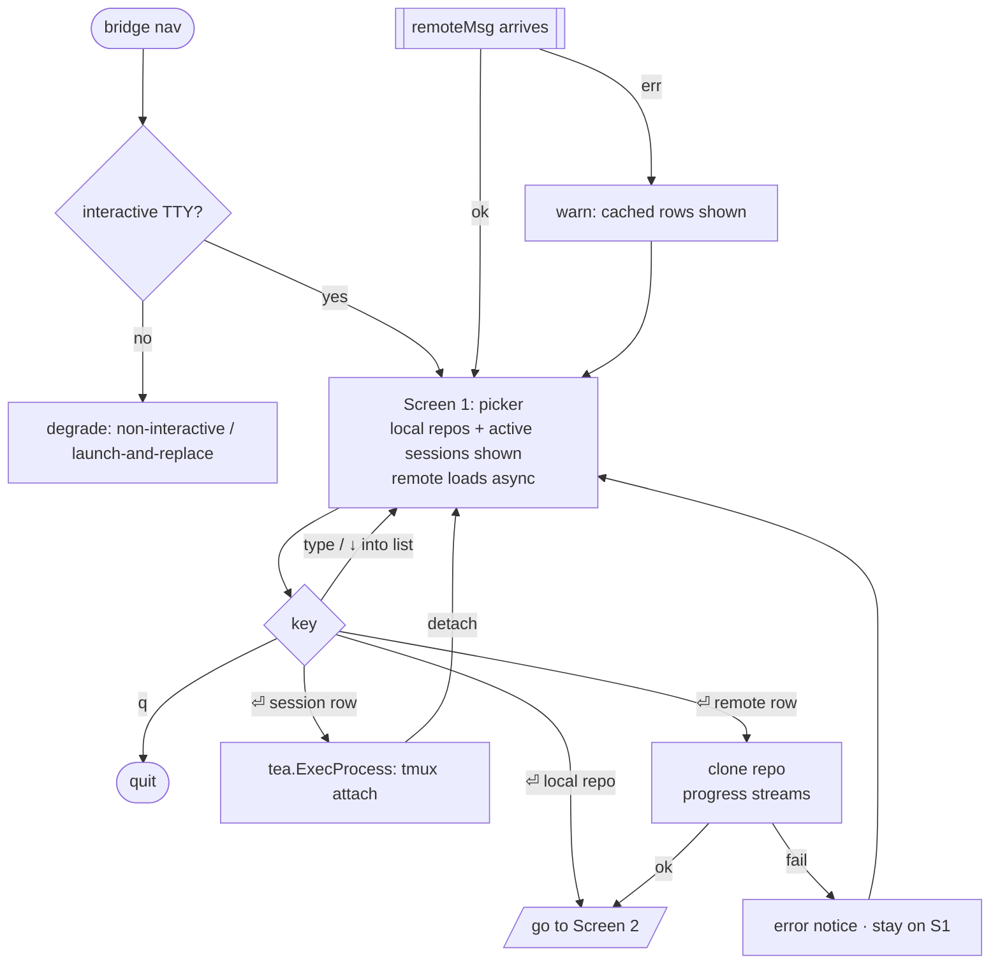
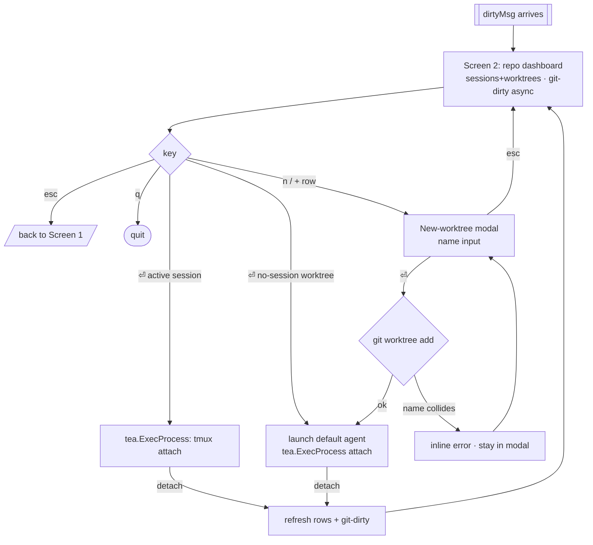
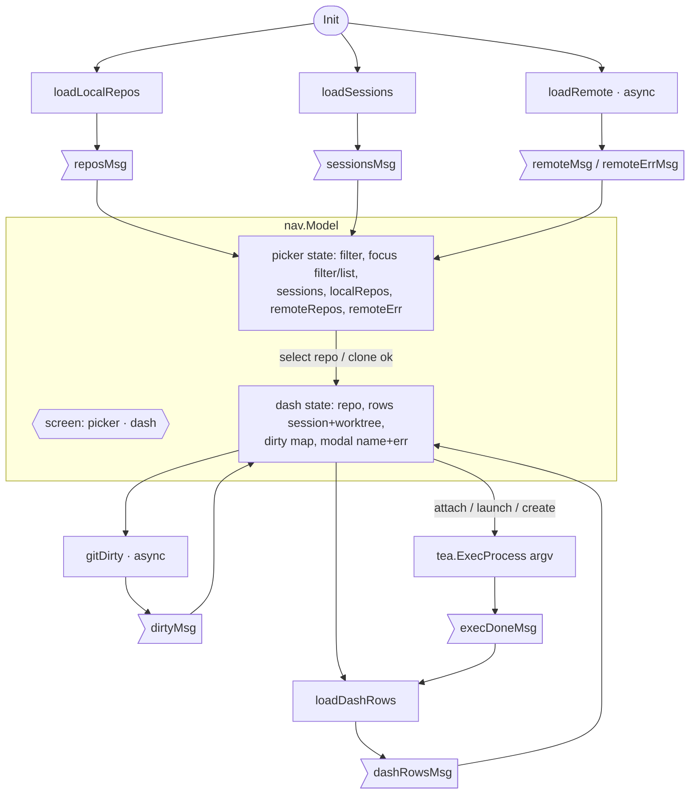

# `bridge nav` — Flow & State Map (UI Phase 2)

Approved 2026-05-31. Maps the approved [wireframe](wireframe.md) onto a single
Bubble Tea program. For a TUI the "component map" is the model's states + the
`tea.Msg`/`tea.Cmd` graph (per the Go stack overlay).

## Diagram 1a — User journey: Screen 1 (picker)

## Diagram 1b — User journey: Screen 2 (dashboard)

## Diagram 2 — State & message map (single `tea.Program`)

### Services (packages) each Cmd calls — props down, events up via `Msg`

| Cmd | Calls (reused, untouched) |
|---|---|
| `loadLocalRepos` | `core.DiscoverRepos` |
| `loadSessions` | `core.LiveSessions` + `core.LoadSlots` |
| `loadRemote` | `forge.ReadRepoCache` (then optional fetch) |
| clone (on remote select) | `cloneRemoteRepo` (`forge` + `git`) |
| `loadDashRows` | `core` sessions/slots + `git worktree list` |
| `gitDirty` | `git -C <wt> status --porcelain` / `rev-list` |
| create worktree | `worktree.Resolve` / `git worktree add` |
| attach / launch | `internal/launcher` argv → `tea.ExecProcess` |

## Screen inventory check

- **Clone progress** — transient streaming state on `↓ remote` select (git clone
  output, then → Screen 2); failure returns to Screen 1. Not a separate screen.
- **Non-TTY / SSH-child fallback** — not a screen; `bridge nav` detects no usable
  TTY and prints a notice + degrades.
- **No destructive actions in v1** — no worktree/session deletion, so no
  confirmation dialog yet.

## Scope decision (recorded)

Git information is split into two layers; **only Layer 1 is in this spec**:

- **Layer 1 (v1, this spec):** per-row git-dirty indicator on Screen 2.
- **Layer 2 (deferred, separate cycle):** the btop dashboard panels — Branches ·
  Recent commits · Git status (full) · Open issues · forge statusbar. The v1
  layout reserves footer space for them so they are additive later.
